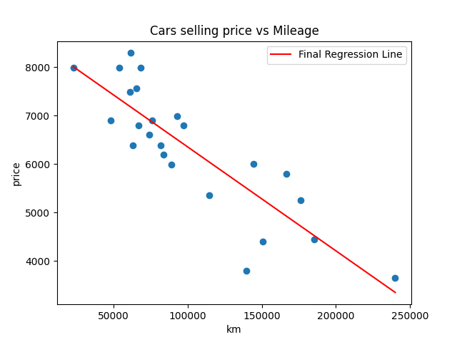
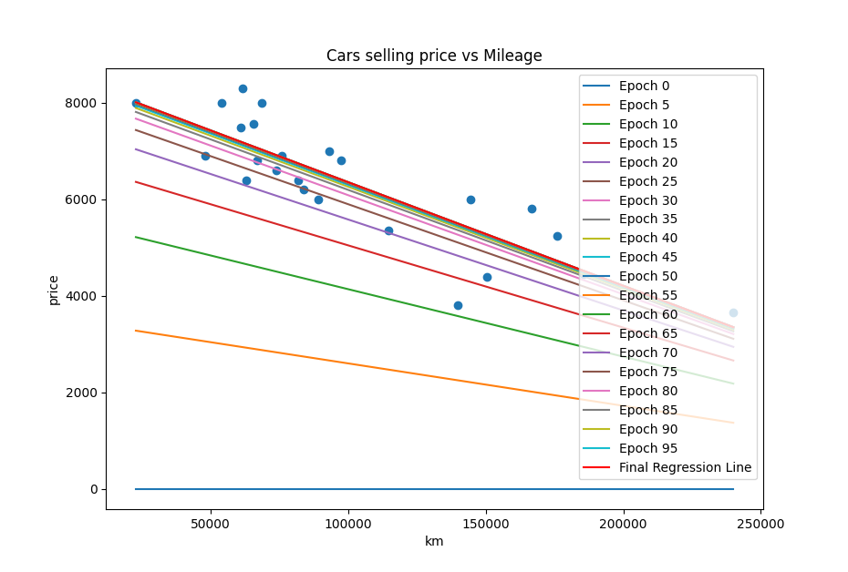

# linear_regression
My very first machine learning project, an implementation of simple linear regression.



## Overview

Linear regression is a statistical method for modeling the relationship between a dependent variable and one or more independent variables. It assumes a linear relationship between the independent variables (features) and the dependent variable (target). 

This particular example is very simple since it only features one independant variable. 

### train.py
The train.py script takes the data.csv as input, which contains data about selling prices of cars depending on their mileage in kilometers.   
This data is used to do the training and find the best parameters for our model, using a gradient descent algorithm to update our two parameters theta0 and theta1 until the mean squared error is close enough to a minimum. The following picture represents a few of the different tries made by the algorithm, starting from theta0 = 0 and theta1 = 0 (Epoch 0) to values that get closer and closer to a minimum cost (Epoch 10000).



The final values for these two parameters are saved in a "thetas.csv", and the resulting regression line can be visualized along with the original scattered data (represented by the blue dots).

### predict.py
This second script loads the values produced by the training phase and uses them to estimate the selling price of a car depending on its mileage.

## Usage
1. Install required dependencies if needed :  
    ```
    pip install numpy pandas matplotlib
    ```
2. Train the machine with the data file
    ```
    python linear_regression.py data.csv
    ```
3. Use the obtained values to predict an estimate selling price for any mileage
    ```
    python predict.py
    ```
